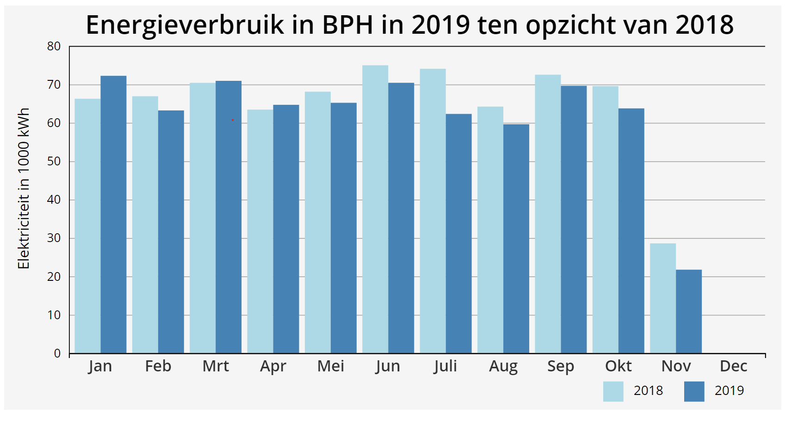

In this repo I've made a chart using [d3js](https://d3js.org) to visualize energy consumption with the BPH building of the Amsterdam Univeristy of Applied Science. This is non-public data, exported through an intern system, obtained through [HvA/UvA Facility Services](https://www.hva.nl/over-de-hva/organisatie/diensten/centrale-diensten.html#anker-facility-services).


## How to run

clone this repo

```bash
git clone https://github.com/daoneandonly/Dual-Bar-Chart.git
```

instal http server with npm

```bash
npm install http-server -g
```
start the http server
```sh
http-server ./Dual-Bar-Chart -p 1337
```

Visit http://localhost:1337 to view the graph
