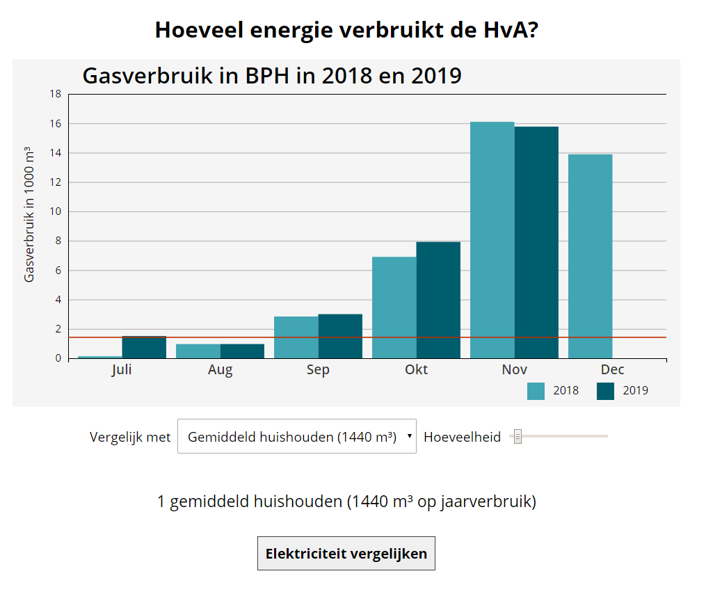

[](https://daoneandonly.github.io/Dual-Bar-Chart/)


# Energy consumption data chart
In this repo I've made a chart using [d3js](https://d3js.org) to visualize energy consumption with the BPH building of the Amsterdam Univeristy of Applied Science. This is non-public data, exported through an intern system, obtained through [HvA/UvA Facility Services](https://www.hva.nl/over-de-hva/organisatie/diensten/centrale-diensten.html#anker-facility-services).

## Table of Contents
  * [Demo](#demo)
  * [How to install](#how-to-install)
  * [Project](#project)
  * [Focus](#focus)
  * [Future refactors](#future-refactors)
  * [Credits](#credits)
  * [License](#license)

## Demo

[Click here for a live demo](https://daoneandonly.github.io/Dual-Bar-Chart/)

## How to install

clone this repo

```bash
git clone https://github.com/daoneandonly/Dual-Bar-Chart.git
```

instal http server with npm

```bash
npm install http-server -g
```
start the http server
```sh
http-server ./Dual-Bar-Chart -p 1337
```

Visit http://localhost:1337 to view the graph

## Project

In this project I worked with real data acquired from the energy consumption from the HvA/UvA. I've narrowed my first proof of concept down to just one building: [the Benno Premsulahuis](https://www.hva.nl/locaties/hva-locaties/benno-premselahuis.html). This building uses both natural gas for heating and electricity for lighting and everything else. The data is exported from the platform esight monitoring.

### Focus

This application was made with these few focusses in mind.

* **Interpretability**

  The data that is exported from the platform is pretty raw. It uses some ugly headers that can not be easily read or manipulated through javascript. The time format was also not exported in a standard format so that had to be cleaned aswell.

* **Adaptability**

  The chart itself should be able to adapt on basis of the data that it is given. Axes should update/scale accordingly. When negative data is included, the chart should appropriate a logical zero-line.

* **Interaction**

  The chart should be in a most simple way interactive. The user can do more than just look at the data but also explore this through some form of interaction.

* **Readability**

  This was more of a personal goal, but I tried to make the code as readable as possible. I've forced myself to make as much comments as possible, to both to make me write a concise explanation of what is happening and helping any person browsing the code help understand my logic.

## Future refactors

* ``let types = {...}`` should be an external variable instead of being defined in ``script.js`` [(here)](https://github.com/daoneandonly/Dual-Bar-Chart/blob/432eefe196ea22ffc01494c68a1caa8af5474054/src/js/script.js#L63)
* The dropdown should be generated based on ``let types = {...}``. This could work through the metaData object.
* Translate entire graph in English. Dutch just doesn't do this graph justice.


## Credits

* Want to take a bit to thank [Curran Kelleher](https://github.com/curran) for this [extensive video tutorial](https://youtu.be/_8V5o2UHG0E). 🎉
* Colors were found through [Sunlight Foundation's styleguide for datavis.](https://sunlightfoundation.com/2014/03/12/datavizguide/) (Alternative [Github link)](https://github.com/amycesal/dataviz-style-guide/blob/master/Sunlight-StyleGuide-DataViz.pdf)


## License

[MIT License](../master/LICENSE)

Copyright (c) 2019 Steven Whitton
